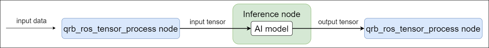

  <h1>QRB ROS Tensor Process</h1>
  
ROS2 package for processing input and output of AI model.

  
  

---

## 👋 Overview

**qrb_ros_tensor_process** is a ROS2 package for:
- Transform the input data into the input tensor required by the AI model.
- Handle the output tensor produced by the AI model.

  

 

**qrb_ros_tensor_process** currently only provide foucs on image data processing, you can access more details in [cv_tensor_common_process](./cv_tensor_common_process).

---

## 🔎 Table of Contents
  * [Supported Targets](#-supported-targets)
  * [Contributing](#-contributing)
  * [License](#-license)

---

## 🎯 Supported Targets

<table >
  <tr>
    <th>Development Hardware</th>
    <th>Hardware Overview</th>
  </tr>
  <tr>
    <td>Qualcomm Dragonwing™ RB3 Gen2</td>
    <th></th>
  </tr>
    <tr>
    <td>Qualcomm Dragonwing™ IQ-9075 EVK</td>
    <th></th>
  </tr>
</table>

---

## 🤝 Contributing

We love community contributions! Get started by reading our [CONTRIBUTING.md](CONTRIBUTING.md).
Feel free to create an issue for bug report, feature requests or any discussion.

---

## 📜 License

Project is licensed under the [BSD-3-Clause](https://spdx.org/licenses/BSD-3-Clause.html) License. See [LICENSE](./LICENSE) for the full license text.
