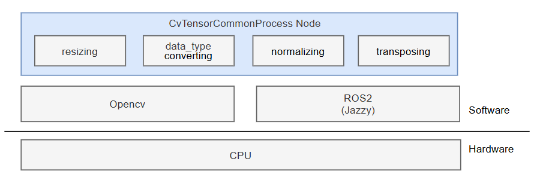

<div align="center">
  <h1>QRB ROS CV TENSOR COMMON PROCESSOR</h1>
  <p align="center">
  </p>
  <p>General-purpose preprocessing ROS2 node for vision-based AI models</p>

  <a href="https://ubuntu.com/download/qualcomm-iot" target="_blank"></a>
  <a href="https://docs.ros.org/en/jazzy/" target="_blank"></a>

</div>

---

## 👋 Overview

**QRB ROS CV TENSOR COMMON PROCESSOR** is a ROS2 package that provides general-purpose preprocessing ROS2 node to meet the needs of vision-based AI models. It offers image resizing, normalization, data type conversion, and tensor layout transformation, allowing you to quickly prepare data for your AI inference pipeline.

<div align="left">
  
</div>

The architecture diagram above illustrates the functionality composition of this ROS2 node. It provides core features:
- resizing : resize input image to desired size
- data type converting : convert pixel value(uint8) into float32/float64
- normalizing : normalize pixel value from uint8 (0 ~ 255) to float32/float64 (0.0 ~ 1.0)
- transposing : transpose tensor shape, NHWC <==> NCWH

## 🔎 Table of Contents

  * [APIs](#-apis)
  * [Supported Targets](#-supported-targets)
  * [Installation](#-installation)
  * [Usage](#-usage)
  * [Build ROS2 Package From Source](#-build-ros2-package-from-source)
  * [Contributing](#-contributing)
  * [License](#-license)

## ⚓ APIs
**ROS Parameters**
  <table>
    <tr>
      <th>Name</th>
      <th>Type</th>
      <th>Description</th>
      <td>Default Value</td>
    </tr>
    <tr>
      <td>target_res</td>
      <td>string</td>
      <td>Target image resolution, e.g. "640x640"</td>
      <td>"0x0"</td>
    </tr>
    <tr>
      <td>normalize</td>
      <td>bool</td>
      <td>Execute normalization or not, "True" or "False"</td>
      <td>True</td>
    </tr>
    <tr>
      <td>tensor_fmt</td>
      <td>string</td>
      <td>Tensor layout: "nhwc" or "nchw"</td>
      <td>"nhwc"</td>
    </tr>
    <tr>
      <td>tensor_fmt</td>
      <td>string</td>
      <td>Output data type: "uint8", "float32", or "float64"</td>
      <td>"float32"</td>
    </tr>
  </table>

**ROS Interfaces**
<table>
  <tr>
    <th>Interface</th>
    <th>Name</th>
    <th>Type</th>
    <td>Description</td>
  </tr>
  <tr>
    <td>Subscriber</td>
    <td>/input_image</td>
    <td>qrb_ros_tensor_list_msgs/msg/TensorList</td>
    <td>Input image to be processed</td>
  </tr>
  <tr>
    <td>Publisher</td>
    <td>/encoded_image</td>
    <td>qrb_ros_tensor_list_msgs/msg/TensorList</td>
    <td>Output tensor</td>
  </tr>
</table>

## 🎯 Supported Targets
<table >
  <tr>
    <th>Development Hardware</th>
    <th>Hardware Overview</th>
  </tr>
  <tr>
    <td>Qualcomm Dragonwing™ RB3 Gen2</td>
    <th><a href="https://www.qualcomm.com/developer/hardware/rb3-gen-2-development-kit"></a></th>
  </tr>
    <tr>
    <td>Qualcomm Dragonwing™ IQ-9075 EVK</td>
    <th><a href="https://www.qualcomm.com/products/internet-of-things/industrial-processors/iq9-series/iq-9075"></a></th>
  </tr>
</table>

---

## ✨ Installation

> [!IMPORTANT]
> **PREREQUISITES**: The following steps need to be run on **Qualcomm Ubuntu** and **ROS Jazzy**.<br>
> Reference [Install Ubuntu on Qualcomm IoT Platforms](https://ubuntu.com/download/qualcomm-iot) and [Install ROS Jazzy](https://docs.ros.org/en/jazzy/index.html) to setup environment. <br>
> For Qualcomm Linux, please check out the [Qualcomm Intelligent Robotics Product SDK](https://docs.qualcomm.com/bundle/publicresource/topics/80-70018-265/introduction_1.html?vproduct=1601111740013072&version=1.4&facet=Qualcomm%20Intelligent%20Robotics%20Product%20(QIRP)%20SDK) documents.

1. Add Qualcomm IOT PPA for Ubuntu:
```bash
sudo add-apt-repository ppa:ubuntu-qcom-iot/qcom-ppa
sudo add-apt-repository ppa:ubuntu-qcom-iot/qirp
sudo apt update
```

2. Install the Debian packages:
```bash
sudo apt install ros-jazzy-qrb-ros-cv-tensor-common-process
```

## 🚀 Usage

The following ROS launch file shows minimal launch file example to get started.
> This minimal launch example alone does not perform any operation. You still need to provide an image topic and add ROS nodes for tensor processing to build a complete and functional pipeline.
```python
from launch import LaunchDescription
from launch.actions import DeclareLaunchArgument
from launch.substitutions import LaunchConfiguration
from launch_ros.descriptions import ComposableNode
from launch_ros.actions import ComposableNodeContainer
from launch_ros.actions import Node

def generate_launch_description():
    default_target_res = "640x640"
    default_tensor_fmt = "nhwc"
    default_normalize = "True"
    defautl_data_type = "float32"

    default_target_res_arg = DeclareLaunchArgument(
        "target_res",
        default_value=default_target_res,
        description="resolution required by model",
    )

    normalize_arg = DeclareLaunchArgument(
        "normalize",
        default_value=default_normalize,
        description="whether need normalize",
    )

    tensor_fmt_arg = DeclareLaunchArgument(
        "tensor_fmt",
        default_value=default_tensor_fmt,
        description="nhwc or nchw",
    )

    data_type_arg = DeclareLaunchArgument(
        "data_type",
        default_value=defautl_data_type,
        description="flaot32 float64 uint8",
    )

    preprocess_node = ComposableNode(
        package="qrb_ros_cv_tensor_common_process",
        plugin="qrb_ros::cv_tensor_common_process::CvTensorCommonProcessNode",
        name="yolo_preprocess_node",
        parameters=[
            {"target_res": LaunchConfiguration("target_res")},
            {"normalize": LaunchConfiguration("normalize")},
            {"tensor_fmt": LaunchConfiguration("tensor_fmt")},
            {"data_type": LaunchConfiguration("data_type")},
        ]
    )

    container = ComposableNodeContainer(
        name="container",
        namespace="",
        package="rclcpp_components",
        executable="component_container",
        composable_node_descriptions=[preprocess_node],
        output="screen",
    )
    return LaunchDescription(
      [
        container,
      ]
    )
```

---

## 👨‍💻 Build ROS2 Package From Source

Install dependencies:
```bash
sudo add-apt-repository ppa:ubuntu-qcom-iot/qcom-ppa
sudo add-apt-repository ppa:ubuntu-qcom-iot/qirp
sudo apt update
sudo apt install -y libopencv-dev ros-jazzy-qrb-ros-tensor-list-msgs ros-jazzy-qrb-ros-transport-image-type
```

Download the source code and build with colcon:
```bash
source /opt/ros/jazzy/setup.bash
mkdir -p ~/ros-ws/src
cd ~/ros-ws/src

git clone https://github.com/qualcomm-qrb-ros/qrb_ros_tensor_process.git

cd ~/ros-ws/
colcon build --packages-up-to qrb_ros_cv_tensor_common_process
```

## 🤝 Contributing

We love community contributions! Get started by reading our [CONTRIBUTING.md](../../CONTRIBUTING.md).
Feel free to create an issue for bug reports, feature requests, or any discussion 💡.

## 📜 License

Project is licensed under the [BSD-3-Clause](https://spdx.org/licenses/BSD-3-Clause.html) License. See [LICENSE](../../LICENSE) for the full license text.
