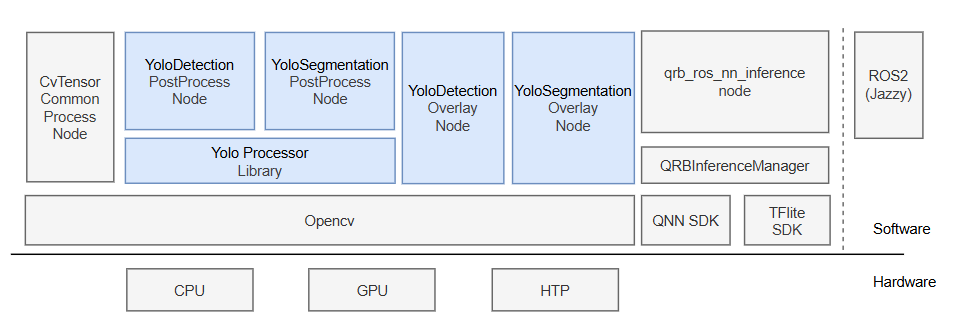

<div align="center">
  <h1>QRB ROS YOLOv8 PROCESSOR</h1>
  <p align="center">
  </p>
  <p>ROS2 package for YOLOv8 detection and segmentation post-processing and visualization</p>
  
  <a href="https://ubuntu.com/download/qualcomm-iot" target="_blank"></a>
  <a href="https://docs.ros.org/en/jazzy/" target="_blank"></a>
  
</div>

---

## 👋 Overview

**QRB ROS YOLOv8 PROCESSOR** provides the ROS nodes and corresponding underlying libraries required for implementing a YOLO-based object detection / segmentation pipeline.

<div align="left">
  
</div>

The architecture diagram above illustrates all functional blocks in a complete YOLOv8 pipeline. The blue blocks are implemented in this project and include:
- **Yolo Detection PostProcess Node** : Provides YOLOv8 object detection post-processing functionality for tensor output from nn-inference nodes
- **Yolo Detection Overlay Node** : Provides visualization functionality for object detection results.
- **Yolo Segmentation PostProcess Node** : Provides YOLOv8 segmentation post-processing functionality for tensor output from nn-inference nodes
- **Yolo Segmentation Overlay Node** : Provides visualization functionality for image segmentation results.
- **Yolo Processor Library** : Library for YOLOv8 post-processing, required by upper-level ROS2 nodes.

## 🔎 Table of Contents

  * [APIs](#-apis)
  * [Supported Targets](#-supported-targets)
  * [Installation](#-installation)
  * [Usage](#-usage)
  * [Build ROS2 Package From Source](#-build-ros2-package-from-source)
  * [Contributing](#-contributing)
  * [License](#-license)

## ⚓ APIs

### 🔹 YoloDetection PostProcessNode APIs
**ROS Parameters**
  <table>
    <tr>
      <th>Name</th>
      <th>Type</th>
      <th>Description</th>
      <td>Default Value</td>
    </tr>
    <tr>
      <td>label_file</td>
      <td>string</td>
      <td>The yaml file that stores the mapping between class-id and class-string</td>
      <td>""</td>
    </tr>
    <tr>
      <td>score_thres</td>
      <td>double</td>
      <td>Confidence threshold in ranges (0.0, 1.0); Detected instance with score above will be kept.</td>
      <td>No default value</td>
    </tr>
    <tr>
      <td>iou_thres</td>
      <td>double</td>
      <td>NMS (Non-Maximum Suppression) parameter IoU for filtering redundant bounding boxes.</td>
      <td>No default value</td>
    </tr>
  </table>

**ROS Interfaces**
<table>
  <tr>
    <th>Interface</th>
    <th>Name</th>
    <th>Type</th>
    <td>Description</td>
  </tr>
  <tr>
    <td>Subscriber</td>
    <td>/yolo_detect_tensor_output</td>
    <td>qrb_ros_tensor_list_msgs/msg/TensorList</td>
    <td>Msg for tensor</td>
  </tr>
  <tr>
    <td>Publisher</td>
    <td>/yolo_detect_result</td>
    <td>vision_msgs/msg/Detection2DArray</td>
    <td>Post-processed detection result.</td>
  </tr>
</table>

### 🔹 YoloDetection OverlayNode APIs
**ROS Parameters**
<table>
  <tr>
    <th>Name</th>
    <th>Type</th>
    <th>Description</th>
    <td>Default Value</td>
  </tr>
  <tr>
    <td>target_res</td>
    <td>string</td>
    <td>Model input tensor resolution, e.g. "640x640"</td>
    <td>No default value</td>
  </tr>
</table>

**ROS Interfaces**
<table>
  <tr>
    <th>Interface</th>
    <th>Name</th>
    <th>Type</th>
    <td>Description</td>
  </tr>
  <tr>
    <td>Subscriber</td>
    <td>/yolo_detect_result</td>
    <td>vision_msgs/msg/Detection2DArray</td>
    <td>Contains the post-processed target information.</td>
  </tr>
  <tr>
    <td>Publisher</td>
    <td>/yolo_detect_overlay</td>
    <td>sensor_msgs::msg::Image</td>
    <td>The final image with detection info.</td>
  </tr>
</table>

### 🔹 YoloSegmentation PostProcessNode APIs
**ROS Parameters**
  <table>
    <tr>
      <th>Name</th>
      <th>Type</th>
      <th>Description</th>
      <td>Default Value</td>
    </tr>
    <tr>
      <td>label_file</td>
      <td>string</td>
      <td>The yaml file that stores the mapping between class-id and class-string</td>
      <td>""</td>
    </tr>
    <tr>
      <td>score_thres</td>
      <td>double</td>
      <td>Confidence threshold in ranges (0.0, 1.0); Detected instance with score above will be kept.</td>
      <td>No default value</td>
    </tr>
    <tr>
      <td>iou_thres</td>
      <td>double</td>
      <td>NMS (Non-Maximum Suppression) parameter IoU for filtering redundant bounding boxes.</td>
      <td>No default value</td>
    </tr>
  </table>

**ROS Interfaces**
<table>
  <tr>
    <th>Interface</th>
    <th>Name</th>
    <th>Type</th>
    <td>Description</td>
  </tr>
  <tr>
    <td>Subscriber</td>
    <td>/yolo_seg_tensor_output</td>
    <td>qrb_ros_tensor_list_msgs/msg/TensorList</td>
    <td>Input tensor message.</td>
  </tr>
  <tr>
    <td>Publisher</td>
    <td>/yolo_seg_result</td>
    <td>qrb_ros_vision_msgs::msg::Detection2DArrayWithMask</td>
    <td>Contains the post-processed target information.</td>
  </tr>
</table>

### 🔹 YoloSegmentation OverlayNode APIs
**ROS Parameters**
<table>
  <tr>
    <th>Name</th>
    <th>Type</th>
    <th>Description</th>
    <td>Default Value</td>
  </tr>
  <tr>
    <td>target_res</td>
    <td>string</td>
    <td>Model input tensor resolution, e.g. "640x640"</td>
    <td>No default value</td>
  </tr>
  <tr>
    <td>mask_res</td>
    <td>string</td>
    <td>Model mask output resolution, e.g. "160x160" </td>
    <td>"160x160"</td>
  </tr>
</table>

**ROS Interfaces**
<table>
  <tr>
    <th>Interface</th>
    <th>Name</th>
    <th>Type</th>
    <td>Description</td>
  </tr>
  <tr>
    <td>Subscriber</td>
    <td>/yolo_segment_result</td>
    <td>qrb_ros_vision_msgs/msg/Detection2DArrayWithMask</td>
    <td>Post-processed segmentation result</td>
  </tr>
  <tr>
    <td>Subscriber</td>
    <td>/resized_image</td>
    <td>sensor_msgs::msg::Image</td>
    <td>Image to overlay segmentation results on.</td>
  </tr>
  <tr>
    <td>Publisher</td>
    <td>/yolo_segment_overlay</td>
    <td>sensor_msgs::msg::Image</td>
    <td>Image with object info & segmentation mask.</td>
  </tr>
</table>


## 🎯 Supported Targets
<table >
  <tr>
    <th>Development Hardware</th>
    <th>Hardware Overview</th>
  </tr>
  <tr>
    <td>Qualcomm Dragonwing™ RB3 Gen2</td>
    <th><a href="https://www.qualcomm.com/developer/hardware/rb3-gen-2-development-kit"></a></th>
  </tr>
    <tr>
    <td>Qualcomm Dragonwing™ IQ-9075 EVK</td>
    <th><a href="https://www.qualcomm.com/products/internet-of-things/industrial-processors/iq9-series/iq-9075"></a></th>
  </tr>
</table>

---

## ✨ Installation

> [!IMPORTANT]
> **PREREQUISITES**: The following steps need to be run on **Qualcomm Ubuntu** and **ROS Jazzy**.<br>
> Reference [Install Ubuntu on Qualcomm IoT Platforms](https://ubuntu.com/download/qualcomm-iot) and [Install ROS Jazzy](https://docs.ros.org/en/jazzy/index.html) to setup environment. <br>
> For Qualcomm Linux, please check out the [Qualcomm Intelligent Robotics Product SDK](https://docs.qualcomm.com/bundle/publicresource/topics/80-70018-265/introduction_1.html?vproduct=1601111740013072&version=1.4&facet=Qualcomm%20Intelligent%20Robotics%20Product%20(QIRP)%20SDK) documents.

1. Add Qualcomm IOT PPA for Ubuntu:
```bash
sudo add-apt-repository ppa:ubuntu-qcom-iot/qcom-ppa
sudo add-apt-repository ppa:ubuntu-qcom-iot/qirp
sudo apt update
```

2. Install Debian packages:
```bash
sudo apt install ros-jazzy-qrb-ros-yolo-process
```

## 🚀 Usage

### 1. Generate YOLOv8 model using QAIHUB

### 🔹Install and setup QAIHUB
> Need sign in to [QAIHUB](https://app.aihub.qualcomm.com/docs/hub/getting_started.html).

```bash
## It is recommended to use python venv to avoid impacting the host environment
mkdir venv_qaihub
python -m venv venv_qaihub
source venv_qaihub/bin/activate
 
## install qai-hub related python packages
pip install qai-hub==0.31.0

## configure qai-hub token, replace xxx with your own token got from qaihub page.
qai-hub configure --api_token xxx

pip install qai-hub-models[yolov8_det]==0.31.0
pip install qai-hub-models[yolov8_seg]==0.31.0
```


### 🔹Export model

> For YOLOv8 segmentation model export, you may need to modify the tensor output shape as follows:
```bash
vim venv_qaihub/qaihub/lib/python3.12/site-packages/qai_hub_models/models/_shared/yolo/model.py

## 1. Find "def get_channel_last_outputs()"
## 2. Change "return ["protos"]" to "return [""]"
```

Supported target runtimes for different devices in the current ROS package are as follows.
<table>
  <tr>
    <th>Target</th>
    <th>Supported Runtime</th>
    <th>Device Name</th>
    <th>Chipset Name</th>
  </tr>
  <tr>
    <td>RB3 Gen2</td>
    <td>tflite</td>
    <td>"RB3 Gen 2 (Proxy)"</td>
    <td>"qualcomm-qcs6490-proxy"</td>
  </tr>
  <tr>
    <td>IQ-9075 EVK</td>
    <td>tflite / qnn</td>
    <td>"QCS9075 (Proxy)"</td>
    <td>"qualcomm-qcs9075-proxy"</td>
  </tr>
</table>

```bash
# Export YOLOv8 detection model
## Please replace params <supported-runtime> and <chipset> as per the table above.
## Example: 
##   python -m qai_hub_models.models.yolov8_det.export --target-runtime "qnn" --chipset "qualcomm-qcs9075-proxy" --skip-profiling --skip-inferencing
python -m qai_hub_models.models.yolov8_det.export --target-runtime "<supported-runtime>" --chipset "<chipset>" --skip-profiling --skip-inferencing

# Export YOLOv8 segmentation model
python -m qai_hub_models.models.yolov8_seg.export --target-runtime "<supported-runtime>" --chipset "<chipset>"  --skip-profiling --skip-inferencing
```

### 2. Run YOLOv8 pipeline
> This project only includes the ROS package related to post-processing in the YOLO pipeline.\
> For a complete YOLO pipeline including image input, preprocessing and post-processing, please refer to:
> * [sample_object_detection](https://github.com/qualcomm-qrb-ros/qrb_ros_samples/tree/main/ai_vision/sample_object_detection)
> * [sample_object_segmentation](https://github.com/qualcomm-qrb-ros/qrb_ros_samples/tree/main/ai_vision/sample_object_segmentation)

---

## 👨‍💻 Build ROS2 Package From Source

Install dependencies:
```bash
sudo add-apt-repository ppa:ubuntu-qcom-iot/qcom-ppa
sudo add-apt-repository ppa:ubuntu-qcom-iot/qirp
sudo apt update
sudo apt install -y libopencv-dev libyaml-dev ros-jazzy-qrb-ros-tensor-list-msgs ros-jazzy-qrb-ros-vision-msgs
```

Download the source code and build with colcon:
```bash
source /opt/ros/jazzy/setup.bash
mkdir -p ~/ros-ws/src
cd ~/ros-ws/src

git clone https://github.com/qualcomm-qrb-ros/qrb_ros_tensor_process.git

cd ~/ros-ws/
colcon build --packages-up-to qrb_ros_yolo_process
```

## 🤝 Contributing

We love community contributions! Get started by reading our [CONTRIBUTING.md](../../CONTRIBUTING.md).  
Feel free to create an issue for bug reports, feature requests, or any discussion 💡.

## 📜 License

Project is licensed under the [BSD-3-Clause](https://spdx.org/licenses/BSD-3-Clause.html) License. See [LICENSE](../../LICENSE) for the full license text.
